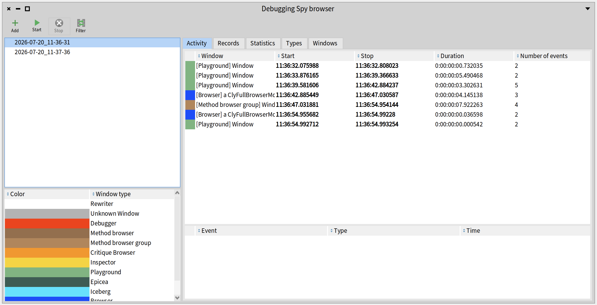
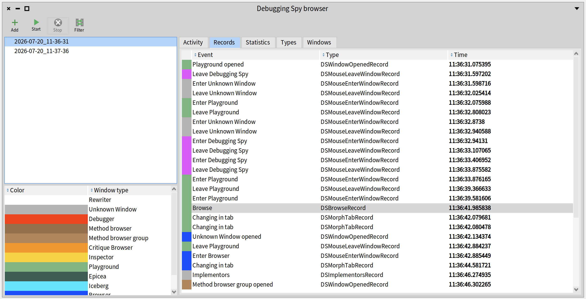
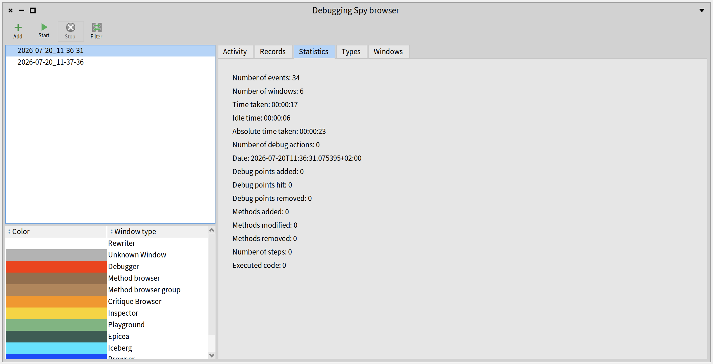
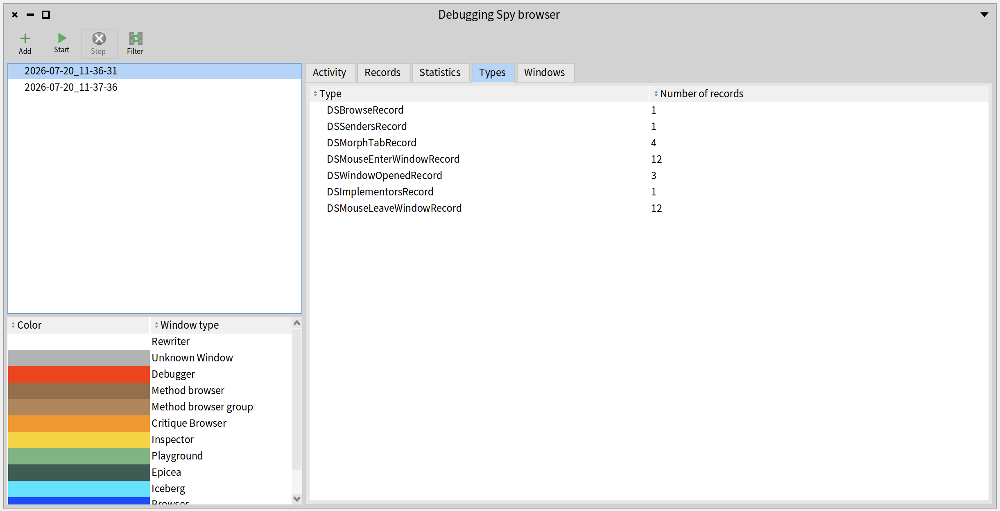
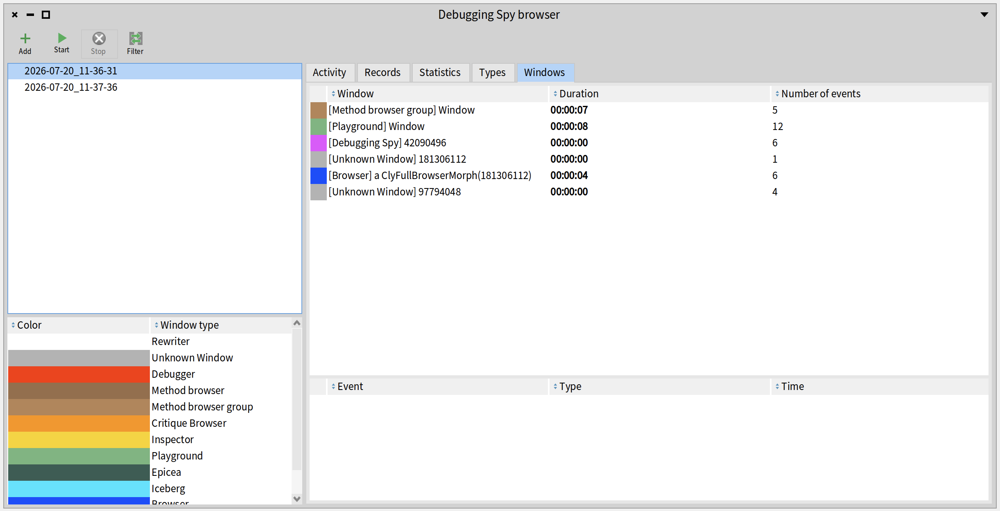

# DebuggingSpy

[](https://github.com/Pharo-XP-Tools/DebuggingSpy/actions/workflows/dsspy.yaml)

A tool to spy on debugging actions for research experiments.

In order to install this repository in a Pharo 14 image, launch the following code in a Playground:

```Smalltalk
Metacello new
    baseline: 'DebuggingSpy';
    repository: 'github://Pharo-XP-Tools/DebuggingSpy:P14';
    load.
```

To cite the use of this tool, please use: https://hal.science/hal-04858378v1

```bib
@softwareversion{costiou:hal-04858378v1,
  TITLE = {{Debugging Spy}},
  AUTHOR = {Costiou, Steven and Van{\`e}gue, Adrien},
  URL = {https://inria.hal.science/hal-04858378},
  NOTE = {},
  INSTITUTION = {{Centre Inria de l'Universit{\'e} de Lille}},
  YEAR = {2024},
  MONTH = Dec,
  SWHID = {swh:1:dir:0f63d67301c0ad3174d17c89a13b52e595837877;origin=https://github.com/Pharo-XP-Tools/DebuggingSpy;visit=swh:1:snp:ae7703ee9ee6f77eb10697b7d9fdf90678a768a0;anchor=swh:1:rev:fbec9a14cbdaa478f498196c0f993062441ef3ae},
  VERSION = {1.0},
  REPOSITORY = {https://github.com/Pharo-XP-Tools/DebuggingSpy},
  LICENSE = {MIT License},
  KEYWORDS = {Debug ; Software instrumentation},
  HAL_ID = {hal-04858378},
  HAL_VERSION = {v1},
}
```

# Usage

To use our system, you can either use the User Interface or command lines in the Pharo Playground.

## User Interface 

After loading the repository in your Pharo Image, a new command button must appear:


Clicking on it will show you the DebuggingSpy's interface:


### Recording session 

To start a recording session, you have to click on the upper left button "Start" in the DebuggingSpy's interface. 
Then a new window with a timer will appear and you can end the session by clicking on the "Stop" button in this window or in the DebuggingSpy's interface.  

The timer window must be at the bottom right of the Pharo IDE and looks like this:


### Visualization

When you have done a recording session, a file of logs is stored into your image's working directory at `Pharo/images/my_pharo_image/ds-spy` and it is named as `YYYY-MM-DD_HH:MM:SS`.

By using the DebuggingSpy's interface, you can add these logs files for visualization. To do this, just click on "Add" button and select a least one file that you want to have in the interface.

Then several tabs offer visualizations:

- "Activity" groups logs as activities into a window and order them chronologically. So you can see in which window an activity happened, when it started and ended (date and time), the duration of this activity and the number of events recorded in it. Activities with duration of less than 0.5 seconds or containing less than 3 events are not displayed. 



- "Records" shows all logs recorded ordered chronologically. 



- "Statistics" gives some indicators about data such as: number of events, number of windows, time taken, ... 



- "Types" allows to find all logs from a specific type.



- "Windows" groups logs by window so that you can find all events recorded in a specific window. 



Note that the color panel indicates what is the window's type for each record in tabs. 

It is also possible to changes the way of sorting data by using the little arrows next to columns' name. 

## Command lines in Pharo Playground

### Start a recording session

Once you've installed the it is possible to use DebuggingSpy and to start a recording session by executing the following line in a Pharo Playground:
```Smalltalk
DSSpyInstrumenter instrumentSystem
```
After that, the system starts logging. To stop the recording session, execute the following line:
```Smalltalk
DSSpyInstrumenter stopInstrumentation
```

Logs files can be found in the *ds-spy* folder of your image's working directory (`Pharo/images/my_pharo_image/ds-spy`) and they are named as `YYYY-MM-DD_HH:MM:SS`.

### Read logged data with Pharo Objects 

#### Materialize raw logs

You need a reference to the log files, for example, to read the one from the screenshot above in the *ds-spy* folder, execute the following code:
```Smalltalk
raw := DSSpy materialize: 'ds-spy/eb41bb7a-51ec-0d00-9087-17590e41b7db' asFileReference
```
Upon inspection, you obtain a raw list of event, chronologically sorted:


#### Build event history

DebuggingSpy provides a history object which sorts records and gives an API to explore what happened during logging.
The history is obtained by executing:

```Smalltalk
history := DSRecordHistory on: raw
```
Upon inspection, the history looks like this:


The history object exposes data organized in different perspectives:
- **records** → the sequential list of logged events.  

- **windows** → the complete list of open windows. Each window contains its own list of events, a list of events grouped by active periods (*activePeriods*, i.e., each period marks an interruption in the window's activity), and the source event (*sourceEvent*) that triggered the window's opening. *(Note: this information is difficult to retrieve automatically and requires manual interpretation to be useful.)*  

- **windowJumps** → the sequential list of activity per window. This allows us to track activity within each window until a switch occurs, showing which window the user jumps to, what they do there, and when they return. Each window jump includes a start event (*startEvent*), an end event (*stopEvent*), a collection of events (*events*) recorded from entry to exit of the window, and the window linked to the activity (*window*, see the previous point). Each window jump corresponds to an activity period from the previous point.  

Some windows may have unusual names, such as:  

- **external window** → a window that was already open before measurements began (typically, in our data, this is the window displaying instructions).  

- **Weird titles like "Color: a color window"** → this is an application window, typically the program being debugged, rather than a tool window.

- Windows that correspond to the opening of a debugger, and only those, have a *source event* indicating which event triggered the window's opening. This applies only at the *window* level, not at the *jump* level. A jump is triggered by a mouse movement from one window to another. To determine the event that triggered the opening of the window being jumped to, one must use *"window sourceEvent"* from the jump.

- The activity records, also referred to as *jumps* or *basic blocks* depending on the context, now respond to *windowId*. This information indicates that the activity was performed in a window of the same id. This is a lazy accessor.

The history object exposes an API to explore the logged execution: (TODO: the API should be documented)


## Log data to a remote server

For now, we do not have an integrated system for logging data to a remote server. However, it must be done using https://github.com/Pharo-XP-Tools/ExperimentModel 

# Recorded events

| **Type of traces**         | **User activity/block event or action** | **Debugging action** | **Navigation/inspection action** | **Debugging event** | **Code edition action** |
|-----------------------------|------------------------------------------|-----------------------|-----------------------------------|---------------------|--------------------------|
| DebugPoint                 |                                          | x                     |                                   |                     |                          |
| Watch DebugPoint           |                                          | x                     |                                   |                     |                          |
| Halt change                |                                          | x                     |                                   |                     |                          |
| Halt hit                   |                                          |                       |                                   | x                   |                          |
| Clipboard copy             |                                          |                       |                                   |                     | x                        |
| Clipboard paste            |                                          |                       |                                   |                     | x                        |
| Debug it                   | x                                        |                       |                                   |                     |                          |
| Do it                      | ?                                        |                       |                                   |                     |                          |
| Do it and go               | ?                                        |                       |                                   |                     |                          |
| Print it                   |                                          |                       | x                                 |                     |                          |
| Browse                     |                                          |                       | x                                 |                     |                          |
| Implementors               | x                                        |                       |                                   |                     |                          |
| Senders                    | x                                        |                       |                                   |                     |                          |
| Inspect                    | x                                        |                       |                                   |                     |                          |
| Logging error              |                                          |                       |                                   | x                   |                          |
| Method added               |                                          |                       |                                   |                     | x                        |
| Method modified            |                                          |                       |                                   |                     | x                        |
| Method removed             |                                          |                       |                                   |                     | x                        |
| Source code change         |                                          |                       |                                   |                     | x                        |
| Mouse enter window         | x                                        |                       |                                   |                     |                          |
| Mouse leave window         | x                                        |                       |                                   |                     |                          |
| Step                       |                                          | x                     |                                   |                     |                          |
| Window activated           | x                                        |                       |                                   |                     |                          |
| Window opened              | x                                        |                       |                                   |                     |                          |
| Window closed              | x                                        |                       |                                   |                     |                          |
| Proceed command            |                                          | x                     |                                   |                     |                          |
| Restart command            |                                          | x                     |                                   |                     |                          |
| Return value command       |                                          | x                     |                                   |                     |                          |
| Run to selection command   |                                          | x                     |                                   |                     |                          |
| Step into                  |                                          | x                     |                                   |                     |                          |
| Step over                  |                                          | x                     |                                   |                     |                          |
| Step through               |                                          | x                     |                                   |                     |                          |